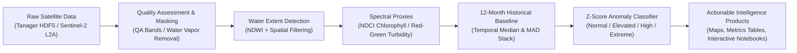

# AQUASPECT
## Egypt Water Quality & Inland/Coastal Water Intelligence

**Proof of Concept - Arab Youth Space Hackathon (813 Challenge) · Theme 6: Water Quality**

[](LICENSE)
[](requirements.txt)
[](#3-data-strategy)

---

## 1. Executive Summary & Problem Statement
Egypt's inland and coastal waters (from the vital aquaculture and fisheries in **Lake Manzala** to the marine ecosystems along the **Red Sea**) face intensifying anthropogenic pressure from agricultural runoff, industrial discharge, and urban effluent. Traditional monitoring relies on sparse, expensive, and time-delayed in-situ water sampling. 

**AQUASPECT** is an end-to-end Earth Observation (EO) intelligence pipeline designed to translate raw hyperspectral and multispectral satellite streams into actionable water quality screening intelligence. It bridges high-resolution spectral identification with long-term statistical anomaly detection to prioritize field inspection and protect marine resources.

---

## 2. Key Scientific Results & Achievements

| Component | Target AOI | Sensor | Key Metric / Result |
|---|---|---|---|
| **Hyperspectral Screening** | El Gouna (Red Sea) | Planet Tanager-1 (426 bands) | **212.37 km²** water extent mapped; continuous 376-2499 nm spectral profile extracted |
| **Turbidity & NDCI Proxy** | El Gouna (Red Sea) | Planet Tanager-1 | High-resolution Red/Green ratio & Red-Edge chlorophyll screening mapped |
| **12-Month Temporal Baseline** | Lake Manzala (Delta) | Copernicus Sentinel-2 L2A | **8 distinct seasonal dates** (June 2024 - May 2025) establishing historical median & MAD |
| **Statistical Anomaly Detection** | Lake Manzala | Sentinel-2 (2025-04-27) | **13,273 pixels (32.2%)** flagged with extreme deviation ($Z \ge 3.0$) vs. 12-month baseline |

---

## 3. Data Strategy
AQUASPECT implements a **Dual-AOI Strategy**:

1. **Planet Tanager-1 Hyperspectral Cube (`20250926_092059_95_4001`)**
   - Location: El Gouna Coast, Egypt (`[33.511°E, 27.334°N, 33.758°E, 27.565°N]`).
   - Spectral resolution: 426 continuous bands (~376-2499 nm) at ~33 m GSD.
   - Purpose: Demonstrates hyperspectral capability to isolate fine spectral features (NDCI red-edge and water-leaving reflectance).

2. **Copernicus Sentinel-2 L2A Time Stack (Lake Manzala)**
   - 8 distinct, low-cloud timestamps spanning a full 12-month annual cycle (2024-06-06 to 2025-04-27).
   - Purpose: Builds a robust historical median baseline of the Red/Green turbidity proxy to eliminate seasonal false positives and detect genuine localized anomalies.

---

## 4. End-to-End Pipeline Architecture



---

## 5. Repository Structure

```
AQUASPECT/
├── data/
│   └── sample_input/              # Scene manifests and STAC query scripts
├── docs/                          # Technical notes, phase audits, and data source citations
├── notebooks/
│   ├── 03_aquaspect_final_poc_executed.ipynb   # Fully executed standalone Jupyter notebook
│   └── 03_aquaspect_colab_executed.ipynb       # Pre-rendered notebook optimized for Google Colab
├── results/
│   ├── figures/                   # 12-month baseline plots & 426-band spectral signatures
│   ├── maps/                      # Water mask, NDCI chlorophyll screening, and turbidity maps
│   └── tables/                    # CSV exports of scene metrics and anomaly statistics
├── scripts/                       # Data processing, validation, and build automation scripts
├── src/
│   └── aquaspect/                 # Modular Python package (preprocessing, indices, detection, viz)
├── requirements.txt               # Dependencies
└── README.md
```

---

## 6. Getting Started & Reproducibility

### Local Setup
```bash
git clone https://github.com/Adel-333/AQUASPECT.git
cd AQUASPECT
pip install -r requirements.txt
```

### Running the Pre-Rendered Notebook
To view the complete analysis with all embedded maps, tables, and figures without re-downloading gigabytes of data:
```bash
jupyter notebook notebooks/03_aquaspect_final_poc_executed.ipynb
```

### Google Colab
Open `notebooks/03_aquaspect_colab_executed.ipynb` directly in Google Colab. All 5 primary spatial maps, spectral signatures, and baseline charts are pre-rendered as embedded outputs.

---

## 7. Scientific Caveats & Validation Integrity

1. **Proxy Indices vs. Physical Quantities**:
   All mapped metrics (NDCI, Red/Green ratio) represent dimensionless optical proxies. Converting these to absolute physical values (e.g., exact $\mu\text{g/L}$ of Chlorophyll-a or NTU turbidity) requires concurrent in-situ calibration measurements.
2. **Statistically Defined Anomalies**:
   The April 27, 2025 event in Lake Manzala is classified strictly as a **statistically extreme deviation ($Z \ge 3.0$)** relative to the 12-month historical median. It is presented as a high-priority screening candidate for field inspection, not as a confirmed toxic bloom.
3. **Validation Honesty**:
   Concurrent open in-situ reference measurements from Egyptian environmental authorities (EEAA/NIOF) were not publicly available for the exact acquisition dates; validation limitations are transparently documented in `docs/phase2_audit.md`.

---

## 8. License & Attribution
- **Code License**: [MIT License](LICENSE)
- **Data Attribution**:
  - Planet Tanager-1 imagery © Planet Labs PBC (Open Archive / CC-BY-4.0).
  - Copernicus Sentinel-2 data processed via Microsoft Planetary Computer STAC API.
